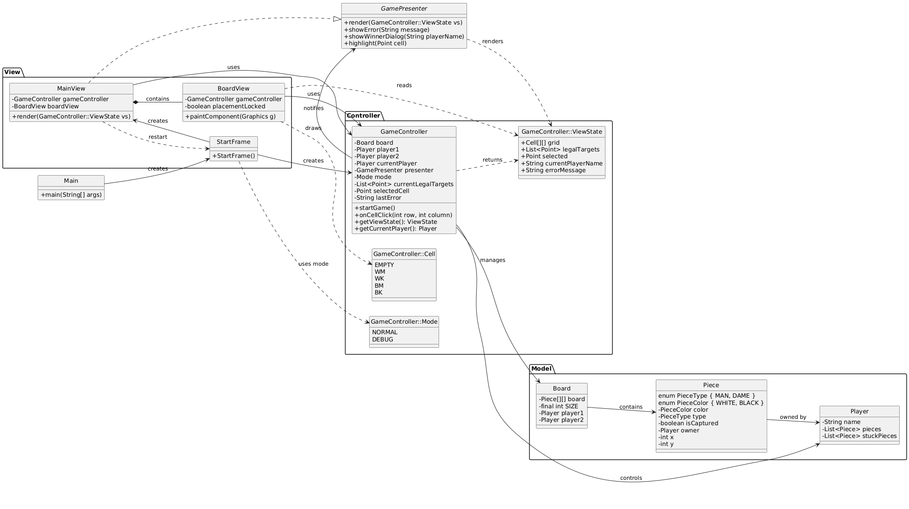

# Checkers

Checkers is a playable Java board game developed as a three-person university project during the Summer Semester 2025.

The project focuses on object-oriented design, graphical user interface development, game-state handling, and collaborative implementation.

## Features

- Playable checkers game with a graphical user interface
- Separation into `model/`, `view/`, and `controller/`
- Standard game mode with the regular starting position
- Debug mode for preparing and testing custom board situations
- UML documentation of the project structure

## Project Structure

```text
.
├── Main.java                 Application entry point
├── controller/               Game flow and move handling
├── model/                    Board, pieces, and game state
├── view/                     User interface and board rendering
├── CONTRIBUTING.md           Contribution information
├── dame.uml                  UML source file
└── klassendiagramm.png       Exported class diagram
```

## Class Diagram



The corresponding UML source file is available in [`dame.uml`](dame.uml).

## Requirements

Java 17 or newer is recommended.

Check the installed versions with:

```bash
java -version
javac -version
```

## Build and Run

The project does not use a dedicated build system and can be compiled directly with `javac`.

### Windows

```bash
javac Main.java controller/*.java view/*.java model/*.java
java -cp ".;view;controller;model" Main
```

### Linux and macOS

```bash
javac Main.java controller/*.java view/*.java model/*.java
java -cp ".:view:controller:model" Main
```

The additional classpath entries are required because the classes are stored in subdirectories without Java `package` declarations.

## Game Modes

### Standard Mode

Starts a regular match using the standard checkers starting position.

### Debug Mode

Starts with an empty board so that specific game situations can be prepared and tested manually.

## Project Context

This repository contains the completed result of a university team project.

The project demonstrates:

- object-oriented Java development
- GUI implementation
- separation of responsibilities
- board-game rule handling
- collaborative development in a three-person team

## Possible Future Improvements

- Introduce Java package declarations
- Add Maven or Gradle as a build system
- Add automated tests for move validation and game rules
- Improve the separation between game logic and the user interface
- Add save and load functionality
- Add move history or replay support
